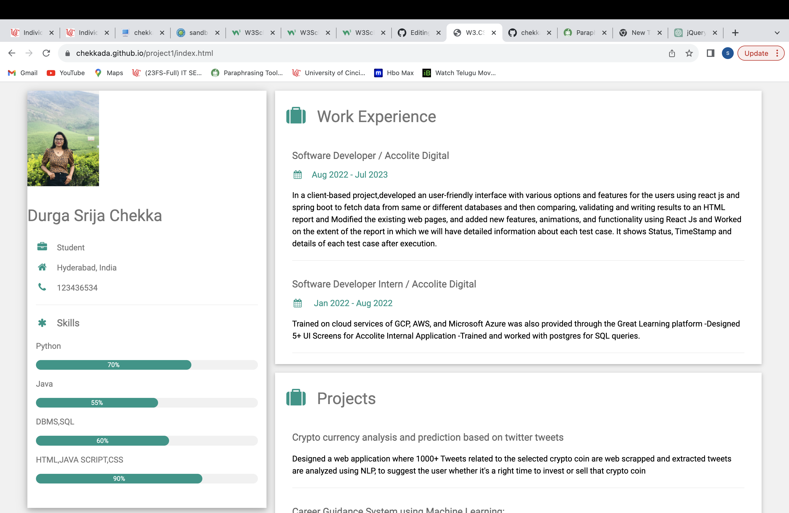
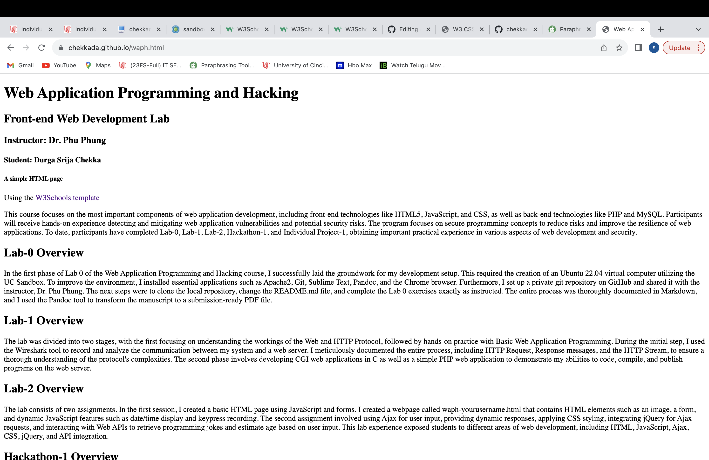
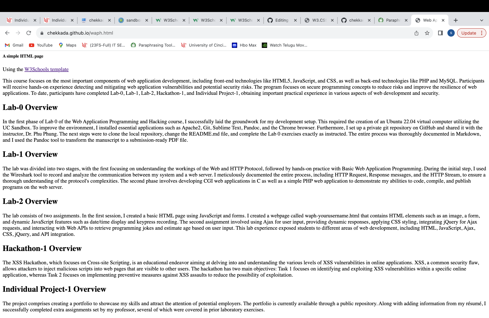
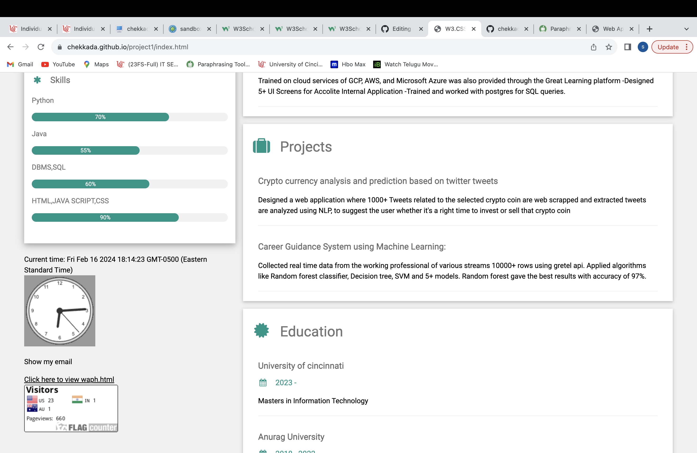
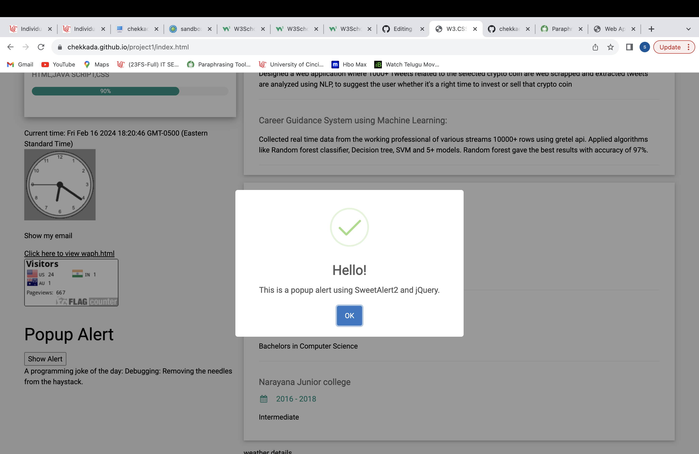
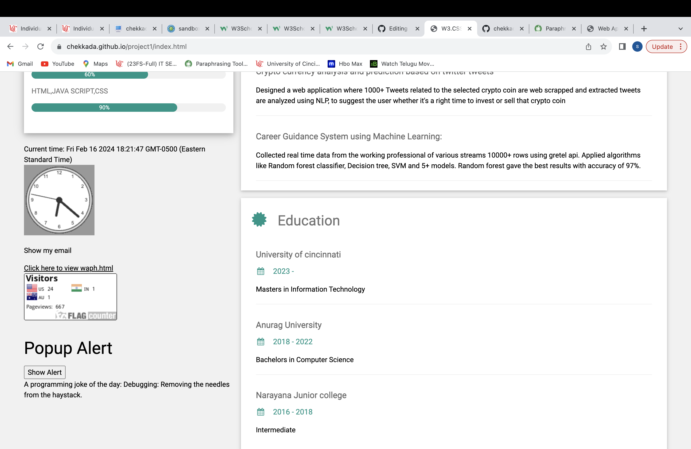
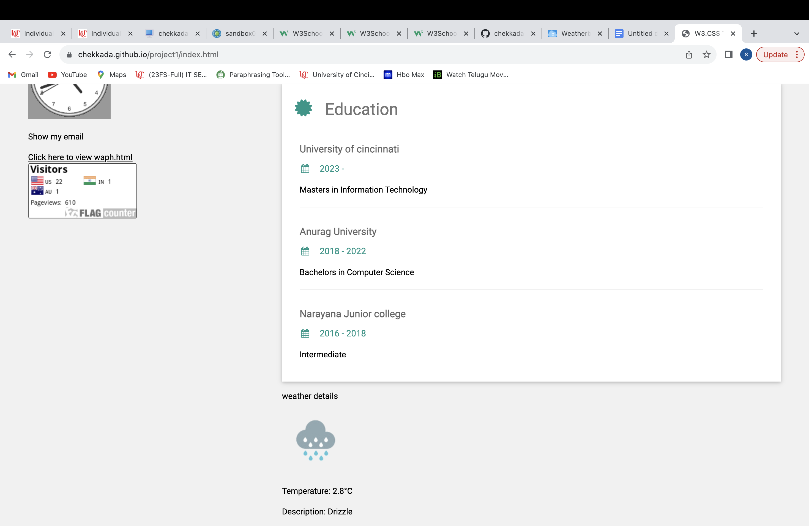
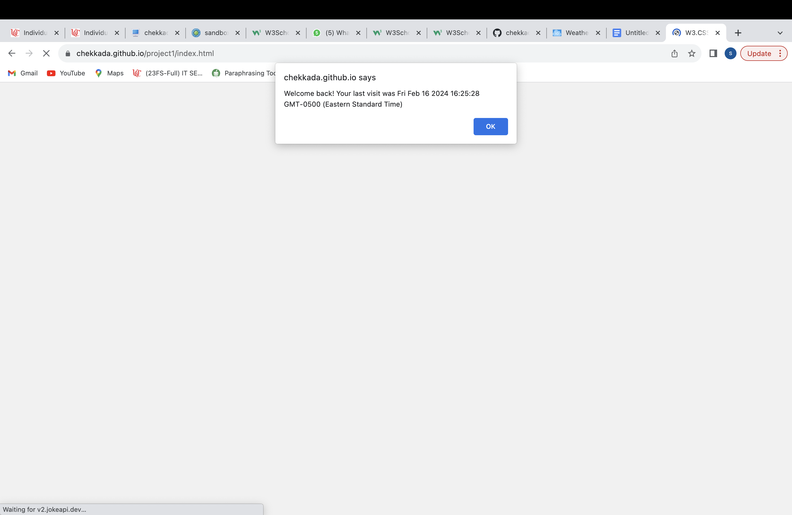
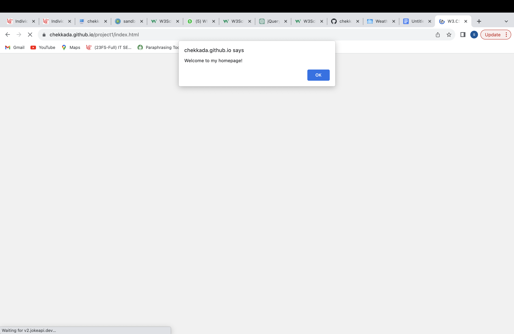

# WAPH-Web Application Programming and Hacking

## Instructor: Dr. Phu Phung

**Name**: Durga Srija Chekka

**Email**: chekkada@mail.uc.edu

**Short-bio**: Durga Srija Chekka has keen interests in cloud computing and Machine learning.


## Repository Information

Respository's URL: [git@github.com:chekkada/waph-chekkada.git](git@github.com:chekkada/waph-chekkada.git)

This is a private repository for Durga Srija Chekka to store all code from the course. The organization of this repository is as follows.

# Individual Project 1 – Front-end Web Development with a Professional Profile Website on github.io cloud service

## Overview and Requirements 

For Individual Project 1, I created a professional profile webpage and hosted it on GitHub Pages. The website showcases my resume, talents, and experiences while also adding numerous technical functionalities such as the joke API, digital clock, analog clock, show my email address, weather API, and flag counter. The primary goals of this project were to improve my front-end web programming skills and gain actual experience deploying websites with GitHub Pages.

The link to access my website is: [https://chekkada.github.io/project1/index.html](https://chekkada.github.io/project1/index.html).

The link to access Individual Project-1 is: [https://github.com/chekkada/chekkada.github.io](https://github.com/chekkada/chekkada.github.io).

## General Requirements

### Personal Website on Github.io

Using the name {chekkada.github.io}, I established a new public repository. developed a personal GitHub Pages website with my resume, contact details, educational background, experiences, projects, certificates, and talents.

The link to access my website is: [https://chekkada.github.io/project1/index.html](https://chekkada.github.io/project1/index.html).



### "Web Application Programming and Hacking" course and related hands-on projects on waph.html file

In order to introduce the "Web Application Programming and Hacking" course and its associated practical projects, I made a new page on my repository called waph.html. I provide summaries of Lab0, Lab1, Lab2, Hackathon 1, and Individual Project 1 in this. 

The link to access waph.html is: [https://chekkada.github.io/waph.html](https://chekkada.github.io/waph.html).

This page link is accessible from the personal website as shown in below screenshot:





## Non-technical requirements

### Bootstrap Template

I have downloaded a bootstrap template from the website `https://bootstrapmade.com/` 

I modified the template to meet my requirements and the assignments provided by the instructor.

### Page Tracker

In order to track website visits and engagement, I included Flag Counter as a page tracker. 

from the two websites that are provided. {https://flagcounter.com/} is my choice. I used the website to produce a key, which I then included into my code. The integrated flag counter is accessible on the homepage of my website.

Code for integrating Flag Counter:

```html
<div style="text-align:left;">
    <a href="https://info.flagcounter.com/szVl"></a>
</div>
```


## Technical requirements

### A digital clock; An analog clock; show/hide your email:

Similar to lab 2, i implemented an analog and digital clock that display the current time using JavaScript. I also included code that  reveal or hide the email address based on user interaction.

Source Code for digital clock:
```JS
function displayTime() {
          document.getElementById('digital-clock').innerHTML = "current time:" + new Date();
        }
        setInterval(displayTime, 500);
```

Source Code for Analog clock:
```JS
var canvas = document.getElementById("analog-clock");
        var ctx = canvas.getContext("2d");
        var radius = canvas.height / 2;
        ctx.translate(radius, radius);
        radius = radius * 0.90
        setInterval(drawClock, 1000);

        function drawClock() {
          drawFace(ctx, radius);
          drawNumbers(ctx, radius);
          drawTime(ctx, radius);
        }
```

Source Code for show/hide your email:

```JS
function showhideEmail() {
      if (shown) {
        document.getElementById('email').innerHTML = "Click here to show my email";
        shown = false;
      }
      else {
        var myemail = "<a href='mailto:sheelada" + "@" + "mail.uc.edu'>sheelada" + "@" + "mail.uc.edu</a>";
        document.getElementById('email').innerHTML = myemail;
        shown = true;
```

Screenshot Showing Digital clock, Analog Clock, Show/hide your email:




### One more Functionality of my choice

Combining jQuery with the SweetAlert2 Library for Popup Alerts
html
Source code :
```JS
<script src="https://code.jquery.com/jquery-3.6.4.min.js"></script>
<script src="https://cdn.jsdelivr.net/npm/sweetalert2@10"></script>
```
 ```JS
    $(document).ready(function() {
      $("#showAlertBtn").click(function() {
        showAlert();
      });

      function showAlert() {
        Swal.fire({
          title: 'Hello!',
          text: 'This is a popup alert using SweetAlert2 and jQuery.',
          icon: 'success',
          confirmButtonText: 'OK'
        });
      }
    });
 ```


### Joke API

Integrated the jokeAPI to fetch a new joke every minute and display it on the website.

Source code for Joke API:

```JS
function fetchJoke() {
          $.get("https://v2.jokeapi.dev/joke/Any?type=single", function (result) {
            console.log("From jokeAPI: " + JSON.stringify(result));
            if (result && result.joke) {
              $("#joke").text("Here's a joke for you: " + result.joke);
            } else {
              $("#joke").text("Could not retrieve a joke at the moment.");
            }
          });
        }

fetchJoke();
setInterval(fetchJoke, 60000);
```


### Weather API

Integrated the Weatherbit API to fetch current weather information for Cincinnati and display it on the website.

```JS

$(document).ready(function () {
// Fetch data from Weatherbit API
$.getJSON("https://api.weatherbit.io/v2.0/current?city=cincinnati&key=08d6dd69bae245f081687c17710408a2", function (data) {
  // Extract relevant weather information
  var temperature = data.data[0].temp;
  var description = data.data[0].weather.description;
  var iconCode = data.data[0].weather.icon;

  // Update weather information
  $("#weather-info").text("Current Temperature: " + temperature + "°C, Weather: " + description);

  //update weather icon
  $("#weather-icon").attr("src", "https://www.weatherbit.io/static/img/icons/" + iconCode + ".png");
  $("#weather-icon").attr("alt", description);
});
});

```



### Javascript Cookies

JavaScript cookies were used to remember the client's visit and show customized messages according to the client's recurring or first-time status. When a user visits for the first time, it says "Welcome to my homepage!" and when they return, it says "Welcome back! (Last visit time and date) was when you last visited.

```JS
// Function to set or retrieve the value of a cookie
function setCookie(name, value, days) {
var expires = "";
if (days) {
  var date = new Date();
  date.setTime(date.getTime() + (days * 24 * 60 * 60 * 1000));
  expires = "; expires=" + date.toUTCString();
}
document.cookie = name + "=" + (value || "") + expires + "; path=/";
}

function getCookie(name) {
var nameEQ = name + "=";
var ca = document.cookie.split(';');
for (var i = 0; i < ca.length; i++) {
  var c = ca[i];
  while (c.charAt(0) === ' ') c = c.substring(1, c.length);
  if (c.indexOf(nameEQ) === 0) return c.substring(nameEQ.length, c.length);
}
return null;
}

// Function to display the welcome message
function displayWelcomeMessage() {
var lastVisit = getCookie("lastVisit");
if (!lastVisit) {
  // First-time visit
  setCookie("lastVisit", new Date().toISOString(), 30); // Set cookie to expire in 30 days
  alert("Welcome to my homepage!");
} else {
  // Returning visit
  var lastVisitDate = new Date(lastVisit);
  alert("Welcome back! Your last visit was " + lastVisitDate.toLocaleString());
}
}

// Call the function when the page loads
window.onload = displayWelcomeMessage;

```


